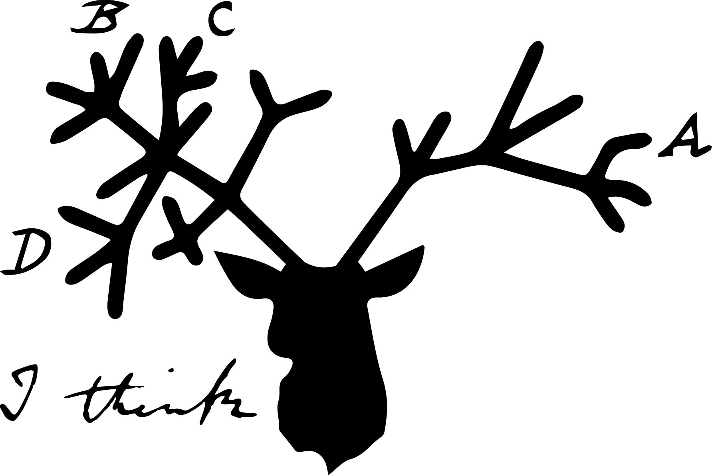

# STAG: Species Tree inference from All Genes



STAG is a LINUX tool for inferring a species tree from a set of gene trees. Its major advantage is that it can use all gene families as input to the species tree inference rather than just one-to-one orthologues that almost all other methods are limited to. In many cases this provides significantly more data on which to base species tree inference. A second advantage is that the user does not need to select the genes to be used for species tree inference. It can take as input the directory of all gene trees for a set of species and it will use those trees that are appropriate.

### Installation:
STAG can just be downloaded from the 'Releases' tab and run without needing to be installed but it requires the FastME program to be installed or in the system path.

#### FastME
FastME can be obtained from http://www.atgc-montpellier.fr/fastme/binaries.php. The package contains a 'binaries/' directory. Choose the appropriate one for your system and copy it to somewhere in the system path e.g. '/usr/local/bin'** and name it 'fastme'. E.g.:

- `sudo cp fastme-2.1.5-linux64 /usr/local/bin/fastme`

### Usage:
An example dataset is supplied, it is the complete set of gene trees for a set of 22 Fungal species and takes less than a minute to run.

To infer the species tree for these species run:
`python stag.py ExampleData/Fungi_SpeciesMap.txt ExampleData/Fungi_Gene_Trees/`
This will analyse the gene trees and write the unrooted species tree to a results directory with todays date. E.g. at the end of the run you should see something like this:

```
Examined 10784 trees
1583 trees had all species present and will be used by STAG to infer the species tree

STAG species tree: /home/david/workspace/git/STAG/stag/ExampleData/STAG_ResultsFeb02/SpeciesTree.tre
```

The species tree is unrooted and has branch lengths and supported values calculated from the input gene trees. You can use your gene trees to root the species tree using https://github.com/davidemms/STRIDE:

`python ../STRIDE/stride/stride.py -s second_dash -S /home/david/workspace/git/STAG/stag/STAG_ResultsFeb02_1/SpeciesTree.tre -d stag/Fungi_Gene_Trees/`

### OrthoFinder Integration:
The best way to generate the complete set of gene trees for your species is with OrthoFinder: https://github.com/davidemms/OrthoFinder/

STAG is designed to work with OrthoFinder output. Instead of preparing at species map file you can jsut use the SpeciesIDs.txt file found in the OrthoFinder WorkingDirectory. E.g.
`python stag.py ExampleData/Fungi_SpeciesIDs.txt ExampleData/Fungi_Gene_Trees/`
